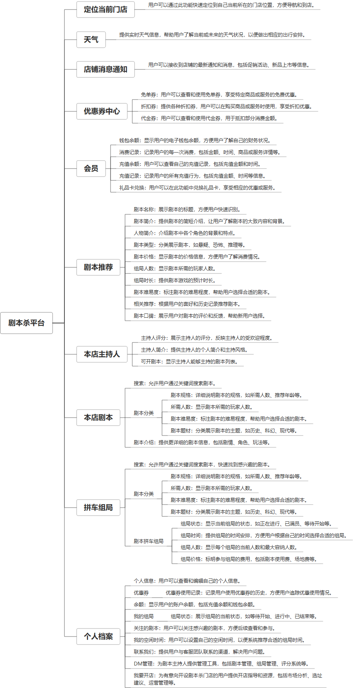

 

    
 

公司拥有上百套具有自主知识产权的软件系统，详情请查看码云首页或公司官网

 
<h1>剧本杀平台</h1>

<a href="https://www.haishi.net.cn/">公司官网</a> ｜ <a href="https://www.haishi.net.cn/">在线体验</a>

 

## 系统介绍

服务业-剧本杀-组局系统
谜局剧本杀系统为了解决现市面上大部分实体剧本杀店铺的获客难、管理难、对客户介绍难的三大痛点进行数字化的改造。
系统内包含了剧本介绍/拼车组局/剧本介绍/会员营销的四个板块，采用了多端管理的理念，便利剧本杀店长管理，结合了当下比较流行的私域流量的管理方式，对店铺会员进行精细化管理，减少对会员的信息推送，增加触达效率
服务业-剧本杀-组局系统
谜局剧本杀系统为了解决现市面上大部分实体剧本杀店铺的获客难、管理难、对客户介绍难的三大痛点进行数字化的改造。
系统内包含了剧本介绍/拼车组局/剧本介绍/会员营销的四个板块，采用了多端管理的理念，便利剧本杀店长管理，结合了当下比较流行的私域流量的管理方式，对店铺会员进行精细化管理，减少对会员的信息推送，增加触达效率
本项目名称为剧本杀服务及管理SaaS平台，旨在为剧本杀门店提供一站式服务，涵盖从剧本管理、客户管理到拼车组局等功能。该平台提供小程序端供用户使用，方便用户查看剧本、拼车组局、管理个人信息等。平台致力于提升剧本杀门店的运营效率和用户体验，促进剧本杀行业的健康发展。
本项目目前已知提供小程序端：
- 小程序端：用户使用，可以查看主持人列表、本店剧本详情、拼车组局信息、管理个人中心（优惠券、钱包、组局、关注的剧本、空闲时间、DM管理）等。
                

## 系统功能介绍

### 系统包含终端说明

管理端（WEB）、用户端（微信小程序）

| 序号 | 模块 | 模块说明 |
| --- | --- | --- |
| 1 | jubensha | 未知类型 |
| 2 | FWY-JBS-ZJPT-SERVER | 服务端 |
| 3 | FWY-JBS-ZJPT-H5-MANAGE | 管理端 |
| 4 | FWY-JBS-ZJPT-MANAGE | 管理端 |
| 5 | FWY-JBS-ZJPT-MP-USER | 未知类型 |
| 6 | FWY-JBS-ZJPT-MP-MANAGE | 管理端 |

### 系统功能结构

### 系统功能说明

主要功能：
- 主持人列表：用户可以查看门店 available 的主持人
- 本店剧本：用户可以查看门店提供的剧本详情，例如剧本简介、玩家数量、游戏时长等
- 拼车组局：用户可以参与或发起拼车组局，方便找到一起玩剧本杀的小伙伴
- 个人中心：用户可以管理个人信息，包括优惠券、钱包、我的组局、关注的剧本、空闲时间以及DM管理等

## 系统主要界面

## 系统技术说明

### 代码模块说明

| 序号 | 目录 | 目录说明 |
| --- | --- | --- |
| 1 | FWY-JBS-ZJPT-SERVER/px-jbs-biz | -- |

### 系统技术选型

#### 开发语言/框架

JAVA（JDK1.8）
前端框架：VUE2

#### 服务中间件

Nginx
Tomcat

#### 数据库

MySQL（5.7+）
Redis

#### 其他说明

无

## 系统演示/商用

请扫码添加客服微信获取演示地址和系统详细资料。

如果您想基于剧本杀平台进行商业化交付或定制开发服务，我们提供有偿的技术服务支持，合作模式不限，欢迎沟通！

公司官网地址： <a href="https://www.haishi.net.cn/">https://www.haishi.net.cn</a>

联系客服获取专业回答。

## 使用须知

1、 本项目商用必须获得版权所有者的授权。

2、 未经允许本项目代码不允许二次出售。

